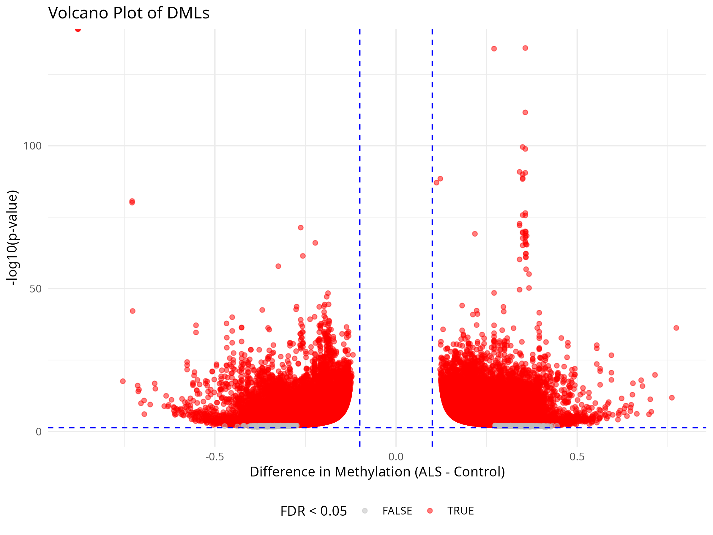
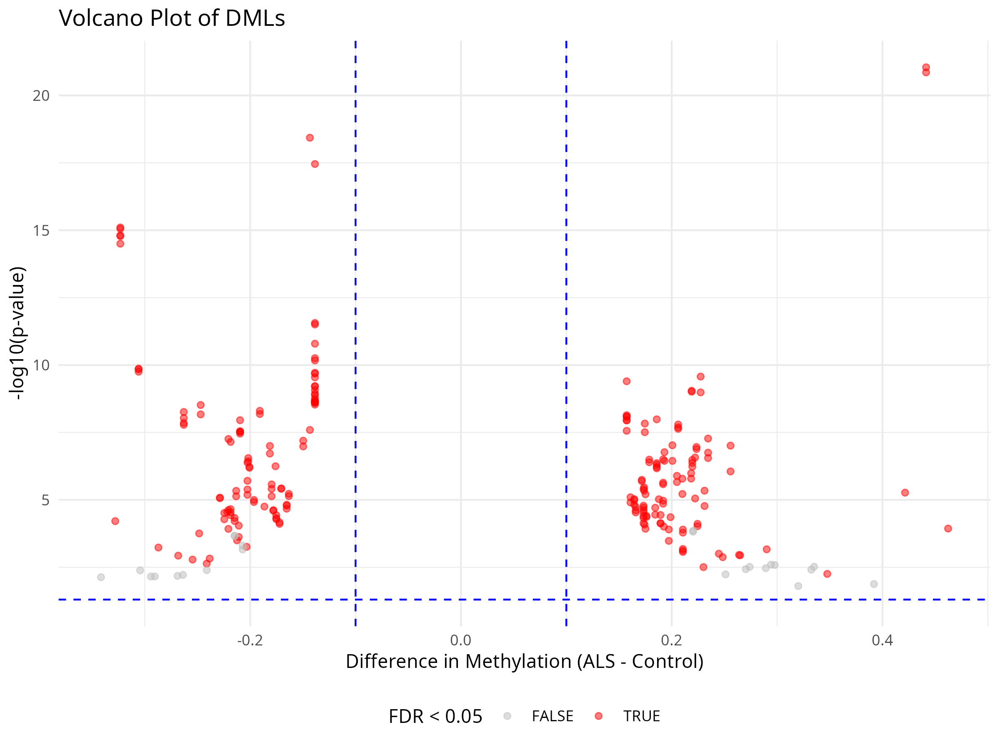
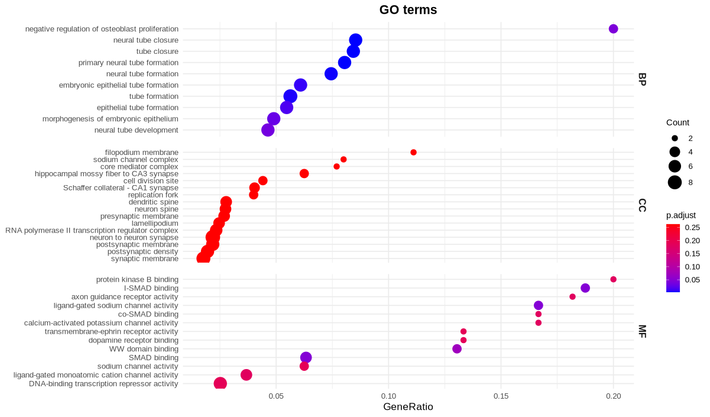

# Differential Methylation Analysis (DMLs and DMRs) in EM-Seq ALS vs Control

This section details the bioinformatics pipeline for identifying and analyzing Differentially Methylated Loci (DMLs) and Regions (DMRs) using Enzymatic Methyl-Seq (EM-seq) data. The analysis was performed as part of my Master's Thesis in Bioinformatics and includes two primary comparisons:

1. **ALS vs. Control samples** – To identify methylation signatures associated with ALS pathogenesis.

2. **ALS phenotypic subgroups (Bulbar-onset vs. Spinal-onset)** – To investigate epigenetic differences between clinical manifestations of ALS.

The pipeline encompasses read methylation calling, quality control and statistical testing for DMLs/DMRs, followed by functional enrichment analysis of significant hits.

## 📂 Directory Structure
```
DMA/
├── Results/ # Final output files (tables, plots, reports)
├── Scripts/ # Analysis scripts (R/Rmd)
└── RDS/ # Intermediate processed data objects
```
## ⚙️ Analysis Pipeline Overview

The DMA workflow consists of three main phases:

1. **Preprocessing & Quality Control**
2. **Differential Methylation Calling**
3. **Functional Enrichment Analysis**

### 1. Preprocessing & Quality Control

Key steps performed in [`DSS_Analysis.R`](Scripts/DSS_Analysis.R) and [`DSS_Analysis_BvsS.R`](Scripts/DSS_Analysis_BvsS.R):

- **SNP filtering**: Removed CpGs overlapping with common SNPs (MAF ≥ 10%)
- **Coverage filtering**: Kept CpGs with ≥10x coverage in ≥4 samples per group (applied separately for ALS vs. Control and Bulbar vs. Spinal comparisons).
- **Batch correction**: Applied limma's `removeBatchEffect` to account for technical variability
- **Quality Control**:
  - Global methylation distributions (stratified by phenotype).
  - PCA of methylation profiles (highlighting ALS vs. Control and Bulbar vs. Spinal clustering).
  - Coverage uniformity across chromosomes.
  - Sample clustering analysis.

  
*Principal Component Analysis showing separation by disease status (ALS/Control) and ALS phenotype (Bulbar/Spinal)*

### 2. Differential Methylation Analysis

Performed using the **DSS** package with consistent parameters for both comparisons:

```r
dmr_params = list(
  delta = 0.1,          # Minimum methylation difference
  p.threshold = 1e-5,   # Significance threshold
  minlen = 50,          # Minimum DMR length (bp)
  minCG = 3,            # Minimum CpGs per DMR
  dis.merge = 100,      # Max distance to merge nearby DMRs
  pct.sig = 0.5         # Minimum proportion of significant CpGs in DMR
)
```
**Key Results:**
1. ALS vs. Control:
    - [DMLs_annotated.tsv](Results/ALSvsCT/DMLs_annotated.tsv): The 69,749 significant DML from the 2,264,336 CpGs tested, top significant DMLs

    - [DMRs_annotated.tsv](Results/ALSvsCT/DMRs_annotated.tsv): The 182 significant DMRs with genomic annotations
2. Bulbar-onset vs. Spinal-onset ALS:
    - [DMLs_annotated.tsv](Results/BulbarvsSpinal_ALS/DMLs_annotated.tsv): The 233 significant DML from the 77,864 CpGs tested, top significant DMLs

    - [DMRs_annotated.tsv](Results/BulbarvsSpinal_ALS/DMRs_annotated.tsv): The 1 significant DMRs with genomic annotations

|  |  |

Volcano plots for ALS vs. Control (left) and Bulbar vs. Spinal (right) comparisons (FDR < 0.05, |Δβ| > 0.10).

### 3. Functional Enrichment Analysis
Performed in [methylation_enrichment_analysis.Rmd](Script/methylation_enrichment_analysis.Rmd) for*both comparisons*:

- Gene Ontology (BP, CC, MF).
- KEGG Pathway analysis.
- DisGeNET disease associations.

  |  
Top enriched pathways for ALS-associated DMLs (A) and Bulbar/Spinal-specific DMLs (B).

## 📊 Key Output Files

**Results Directory**


| File                  | Description                                  |
|-----------------------|---------------------------------------------|
| `DMLs_annotated.*`    | Annotated differentially methylated loci    |
| `DMRs_annotated.*`    | Annotated differentially methylated regions |
| `GO_*.csv`            | Gene Ontology enrichment results           |
| `kegg_*.csv`          | KEGG pathway enrichment results            |
| `QC_*.png`            | Quality control visualizations             |
| `Heatmap_*.png`       | Methylation patterns of top DMLs/DMRs      |
| `session_info.txt`    | Complete R session environment              |

## 🔧 Software Stack

**Primary Packages:**
- DSS (v2.42.0) - Differential methylation calling
- bsseq (v1.36.0) - Bisulfite sequencing data handling
- limma (v3.56.0) - Batch effect correction
- clusterProfiler (v4.8.0) - Functional enrichment

**Visualization:**

- ggplot2 (v3.4.0)

- pheatmap (v1.0.12)

- enrichplot (v1.20.0)

Full environment details in [session_info.txt](Results/ALSvsCT/session_info.txt)

## 📝 Interpretation Notes
1. DML/DMR Thresholds: Used conservative cutoffs (Δβ ≥ 0.1, FDR < 0.05)

2. Batch Effects: Explicitly modeled and corrected using limma

3. Gene Annotation: Combined gene-based and CpG island annotations

4. Biological Relevance: Focused enrichment on neuronal pathways and ALS-associated terms

For detailed methodology, see the individual script headers and thesis documentation.