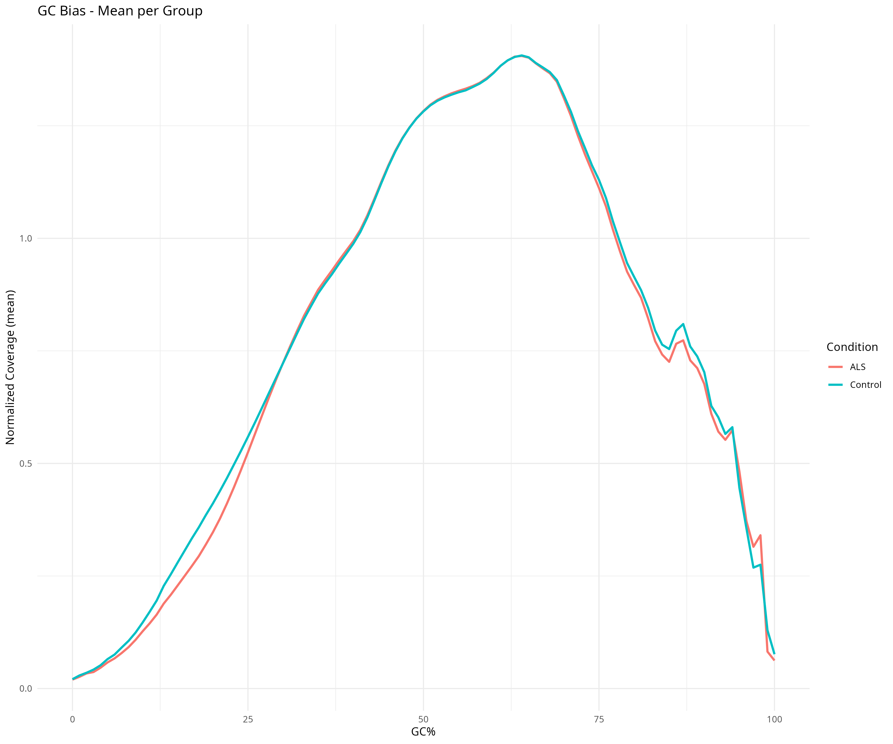
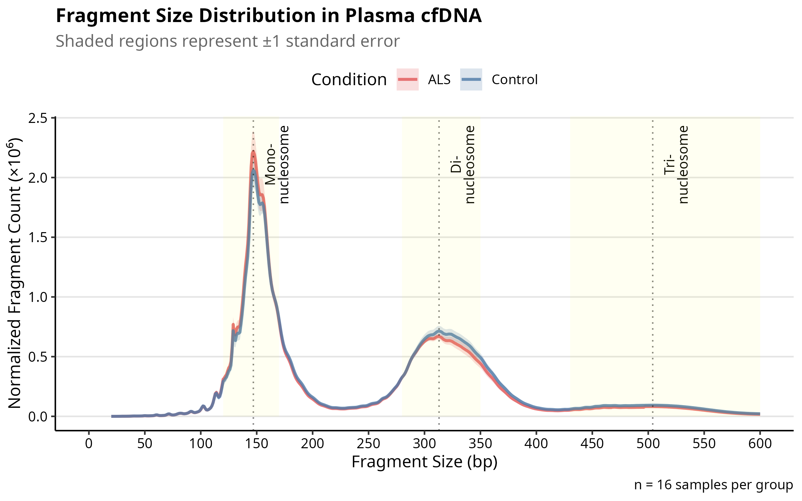
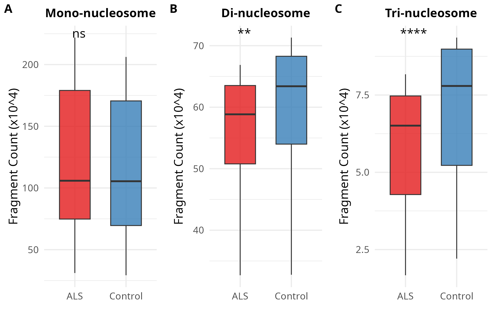
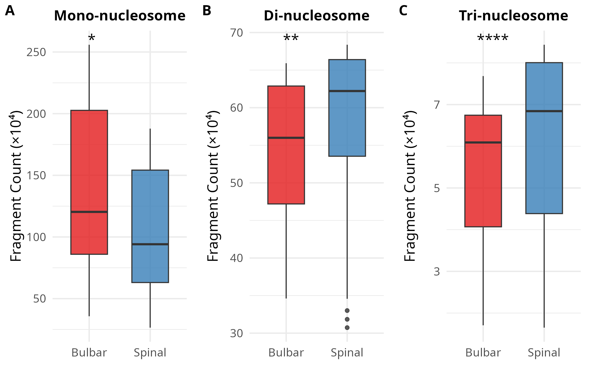

# cfDNA Fragment Analysis Pipeline

**Objective**: Quantify cfDNA fragment size distributions from plasma and explore fragmentation features associated with ALS.

**Input**:
- Deduplicated BAM files (`*.deduplicated.sorted.bam`).
- Sample metadata with condition and phenotype (ALS vs. Control; Bulbar vs. Spinal).

**Directory Structure**:
- `samtools`, `Picard`, `R` (tidyverse, ggplot2, ggpubr).

**Tools**:
```bash
fragment_analysis/
├── Fragment_analysis.Rmd        # R Markdown with full analysis
├── Fragment_analysis.html/pdf   # Exported reports
├── GC_bias_metrics.Rmd        # R Markdown with full analysis
├── GC_bias_metrics.html/pdf   # Exported reports
├── stats/                       # Insert size & GC bias metrics
├── plots/                       # Picard-generated plots per sample
├── figures/                     # Aggregated group-level visualizations
├── results/                     # Summary tables
```

**Steps**:

 ## 0.Set Up Environment

 ```bash
 # Directory structure
mkdir -p fragment_analysis/raw_lengths fragment_analysis/plots fragment_analysis/stats

# List of samples (ALS vs. Controls)
ALS_SAMPLES=("BACW_42" "BACW_45" "BACW_47" "BACW_50" "BACW_53" "BACW_56" "BACW_58" "BACW_65")
CTRL_SAMPLES=("BACW_44" "BACW_48" "BACW_52" "BACW_55" "BACW_57" "BACW_59" "BACW_61" "BACW_64")
```
## 1.Extract Fragment Size from BAMs
`Picard Tools` is used to generate fragment length metrics
```bash
for sample in "${ALS_SAMPLES[@]}" "${CTRL_SAMPLES[@]}"; do
  java -jar picard.jar CollectInsertSizeMetrics \
    I="/path/to/${sample}.deduplicated.sorted.bam" \
    O="fragment_analysis/stats/${sample}_insert_metrics.txt" \
    H="fragment_analysis/plots/${sample}_insert_histogram.pdf" \
    M=0.5
done
```
**Outputs**:

- `stats/*_insert_size_metrics.txt`: summary statistics per sample.

- `plots/*_insert_size_histogram.pdf`: insert size histograms.


## 2. GC Bias Correction

`Tool`: Picard CollectGcBiasMetrics

```bash
java -jar picard.jar CollectGcBiasMetrics \
   I="/path/to/${sample}.deduplicated.sorted.bam" \
   O="fragment_analysis/stats/${sample}_gc_bias_metrics.txt" \
   CHART="fragment_analysis/plots/${sample}_gc_bias_chart.pdf" \
   S="fragment_analysis/stats/${sample}_gc_summary.txt" \
   R="path/to/genome.fa"
```
R Markdown: [GC_bias_metrics.Rmd](/mnt/mydisk/EM_Seq_ALSvsCT/fragment_analysis/GC_bias_metrics.Rmd)


## 3. Data Aggregation and Analysis
R Markdown: [Fragment_analysis.Rmd](/mnt/mydisk/EM_Seq_ALSvsCT/fragment_analysis/Fragment_analysis.Rmd)

This document performs:

- Normalization of fragment counts
- Calculation of short (110–150 bp) and long (200–600 bp) fragment content
- Short-to-long ratio analysis
- Group comparisons (ALS vs Control, Bulbar vs Spinal)
- Visualization and export of plots



## Key Visual Outputs (saved in figures/)
| File                                                  | Description                                      |
|-------------------------------------------------------|--------------------------------------------------|
| `fragment_size_distribution_ALSvsCT.png`              | Insert size profile (ALS vs Control)             |
| `fragment_size_differnces_ALSvsCT.png`                | Mean differences across insert bins              |
| `short-to-long_ratio_ALSvsCT.png`                     | Violin/boxplots of short/long/ratio              |
| `fragment_size_distribution_BulbarvsSpinal.png`       | Insert size profile by ALS phenotype             |
| `fragment_size_differnces_BulbarvsSpinal.png`         | Fragmentation differences (Bulbar vs Spinal)     |
| `Nucleosome_Peak_Abundance_ALSvsCT.png`               | Nucleosome fragment abundance (ALS vs Control)   |
| `Nucleosome_Peak_Abundance_BvsS.png`                  | Nucleosome fragment abundance (Bulbar vs Spinal) |
| `short-to-long_ratio_BulbarvsSpinal.png`              | Ratio analysis by ALS phenotype                  |
| `short-to-long_ratio_BulbarvsSpinal.png`              | Ratio analysis by ALS phenotype                  |
| `GC_by_group.png`              | GC content in ALS and CT groups                  |
| `Supplementary_Figure_2.png`              | Supplementary figure 2 with GC information                  |


## Results Summary
| File                                     | Description                                      |
|------------------------------------------|--------------------------------------------------|
| `results/fragment_size_statistics_ALSvsCT.csv` | Table of insert size summary statistics          |
| `stats/*.txt`                            | Per-sample Picard metrics (insert size, GC bias) |
| `plots/*.pdf`                            | Sample-level plots from Picard       

## Observations
A trend toward increased short (mono-nucleosome) fragments and significantly lower long fragments (di and tri-nucleosome) in ALS vs. controls was observed but did not reach statistical significance.



Bulbar-onset ALS showed significantly lower di and tri-nucleosome fragment abundance and a higher Mono-nucleosome fragment abundance compared to spinal-onset, suggesting potential phenotype-specific fragmentation signatures. These findings are preliminary and based on small sample numbers.

